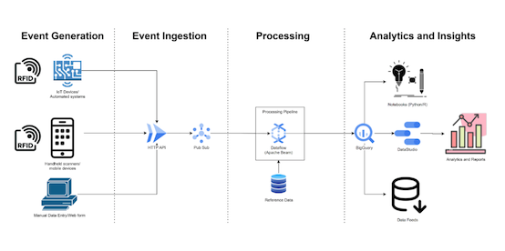
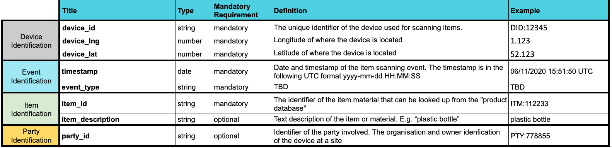

# Topolytics Open Data Standards

> Topolytics data format standards, schemas and technical documentation

## Introduction
This document provides an overview of Topolytic’s proposed architecture for ingesting real time events generated by material flow using PragmaticIC’s flexible RFID tags.

## Architecture Overview

## Event Generation
Events can be generated in a number of ways ranging from IoT/Embedded devices operating in manufacturing/recovery environments through to hand held scanners and manual data entry.

## Event Ingestion
To support the widest range of event sources Topolytics will provide a simple HTTP(s) API endpoint that can receive a POST request with a JSON payload containing the event details. This mechanism can be used by any devices that can connect to the internet and make an HTTP(s) connection.
Topolytics will leverage cloud services provided by Google to ensure that the event ingestion process can scale adequately and all events will be stored in a Pub/Sub event queue.

## Processing
Topolytics will process incoming events using a highly scalable streaming data processing pipeline.
Events will be normalised, processed and combined with reference data as required.

The data processing pipeline will write the processed events into long term storage for further processing.

## Analytics and Insights
Additional processing and analytics will be generated from the stored events. Data can be fed into ad-hoc Python and R notebooks for research, reports generated using DataStudio and exported into other systems using data feeds.

## Event Format
Topolytics propose the following fields for the events (see [examples](./examples.md)):

- device_id - The unique identifier of the device used for scanning items.
- device_coords - Location of where the device is located. This should be longitude/latitude coordinates.
- timestamp - Date and timestamp of the item scanning event. The timestamp is in the following UTC format yyyy-mm-dd HH:MM:SS
- event_type - [Further information about types of events](./events.md)
- item_id - The identifier of the item material that can be looked up from the "product database"
- item_description (optional) - Text description of the item or material. E.g. “plastic bottle”
- party_id (optional) - Identifier of the party involved. The organisation and owner identification of the device at a site

This data should be encoded as valid JSON using UTF-8 character encoding. See Appendex ii for an example POST request using curl.

### Event Schema

The schema documentation complies with the [jsonschema specification](https://json-schema.org/specification.html)

- [Event schema](./schema/events/json/event.schema.md) 
- [Events collection schema](./schema/events/json/events.schema.md)
  

---
