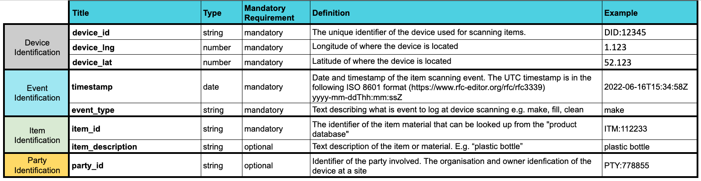

# Topolytics Open Data Standards

> Topolytics data format standards, schemas and technical documentation

## Introduction
This document provides an overview of Topolytic’s proposed architecture for ingesting real-time events generated from IoT systems.

## Architecture Overview

## Event Generation
Events can be generated in several ways ranging from IoT/Embedded devices operating in manufacturing/recovery environments to hand-held scanners and manual data entry.

## Event Ingestion
To support the widest range of event sources Topolytics will provide a simple HTTP(s) API endpoint that can receive a POST request with a JSON payload containing the event details. This mechanism can be used by any device that can connect to the internet and make an HTTP(s) connection.

Topolytics will leverage cloud services provided by Google to ensure that the event ingestion process can scale adequately and all events will be stored in a Pub/Sub event queue.

## Processing

Topolytics will process incoming events using a highly scalable streaming data processing pipeline.

Events will be normalized, processed and combined with reference data as required.

The data processing pipeline will write the processed events into long-term storage for further processing.

## Analytics and Insights
Additional processing and analytics will be generated from the stored events. Data can be fed into ad-hoc Python and R notebooks for research, reports generated using DataStudio and exported into other systems using data feeds.

## Event Format
Topolytics propose the following fields for the events (see [examples](./examples.md)):

- **device_id** - The unique identifier of the device used for scanning items.
- **device_lng** - Longitude of where the device is located.
- **device_lat** - Latitude of where the device is located.
- **timestamp** - Date and timestamp of the item scanning event. The timestamp format (https://www.rfc-editor.org/rfc/rfc3339) `yyyy-mm-ddThh:mm:ssZ`
- **event_type** - [Further information about types of events](./events.md)
- **item_id** - The unique identifier of the item.
- **item_description (optional)** - Text description of the item. E.g. "plastic bottle"
- **party_id (optional)** - Identifier of the party involved. The organization and owner identification of the device at a site

This data should be encoded as valid JSON using UTF-8 character encoding.

## Event Types

The following events have been identified as being relevant to the system.

| Event | Party | Description |
| --- | --- | --- |
| make | manufacturer | A container is made |
| distribute | manufacturer | A container is distributed to a retailer |
| fill | retailer | A container is filled with a product |
| ready_sell | retailer | A container is placed on the shelf ready to be sold |
| returned | customer | A container is returned to a bin at a retailer |
| collected | processor | A bin is collected from a retailer |
| wash | processor | A container is washed |
| destroy | processor | A container is destroyed |

A simple example of the events in a process flow:

Please see [events.md](./events.md) for more information on each event type and a more detailed process flow grouped by the party involved.

## Event Schema

The schema documentation complies with the [jsonschema specification](https://json-schema.org/specification.html)

- [Event schema](./schema/events/json/event.schema.md) 
  

---
