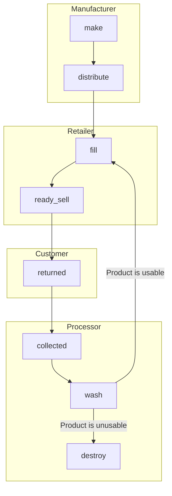

# Events

The following events have been identified as being relevant to the system.

| Event | Party | Description |
| --- | --- | --- |
| make | manufacturer | A container is made |
| distribute | manufacturer | A container is distributed to a retailer |
| fill | retailer | A container is filled with a product |
| ready_sell | retailer | A container is placed on the shelf ready to be sold |
| returned | customer | A container is returned to a bin at a retailer |
| collected | processor | A bin is collected from a retailer |
| wash | processor | A container is washed |
| destroy | processor | A container is destroyed |

## Flow of events:

All events have a common set of attributes:

- **device_id** - The unique identifier of the device used for scanning items.
- **device_lng** - Longitude of where the device is located.
- **device_lat** - Latitude of where the device is located.
- **timestamp** - Date and timestamp of the item scanning event. The timestamp format (https://www.rfc-editor.org/rfc/rfc3339) `yyyy-mm-ddThh:mm:ssZ`
- **event_type** - one of the above events
- **item_id** - The unique identifier of the item
- **item_description (optional)** - Text description of the item or material. E.g. "plastic bottle"
- **party_id (optional)** - The unique identifier of the party
- **party_description (optional)** - Text description of the party.
- **bearer_id (optional)** - The unique identifier of the bearer
- **bearer_description (optional)** - Text description of the type of bearer id. E.g. "Loyalty card"

# make

A container is made by the manufacturer. Typically this will occur when a new batch of containers is made, or when a new container is made to replace a damaged one.

# distribute

A container is distributed to a retailer by the manufacturer.

# fill

A container is filled with a product by the retailer.

# ready_sell

A container is placed on the shelf ready to be sold by the retailer.

# returned

A container is returned to a bin at a retailer by the customer.

**NOTE:** The `device_id` attribute should be the identifier of the bin the item is being return to. this should match the `item_id` used in the `collected` event.

# collected

A bin is collected from a retailer by the processor.

**NOTE:** The `item_id` attribute should be the identifier of the bin that is being collected. This should match the `device_id` used in the `returned` event.

# wash

A container is washed by the processor.

# destroy

A container is destroyed by the processor.